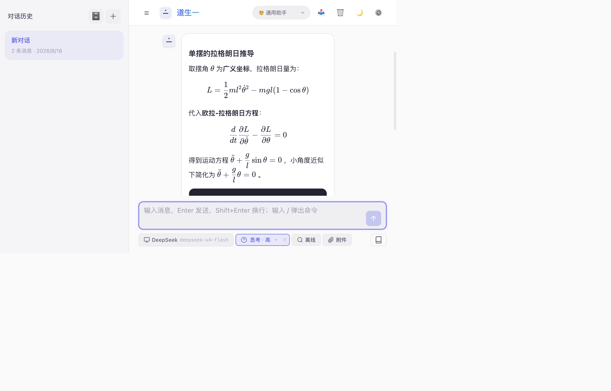
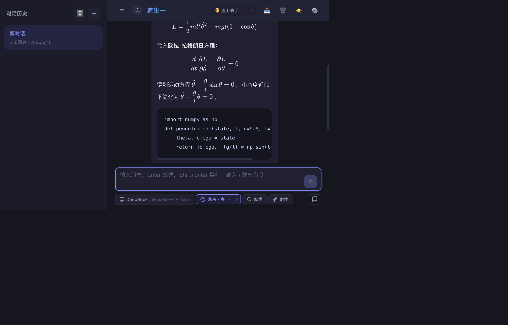
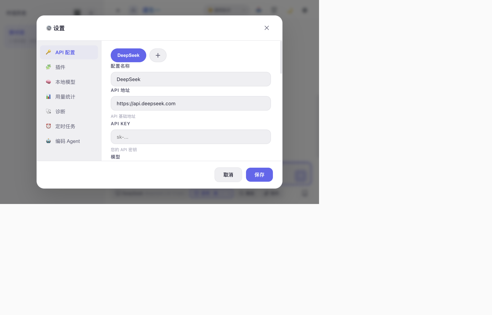
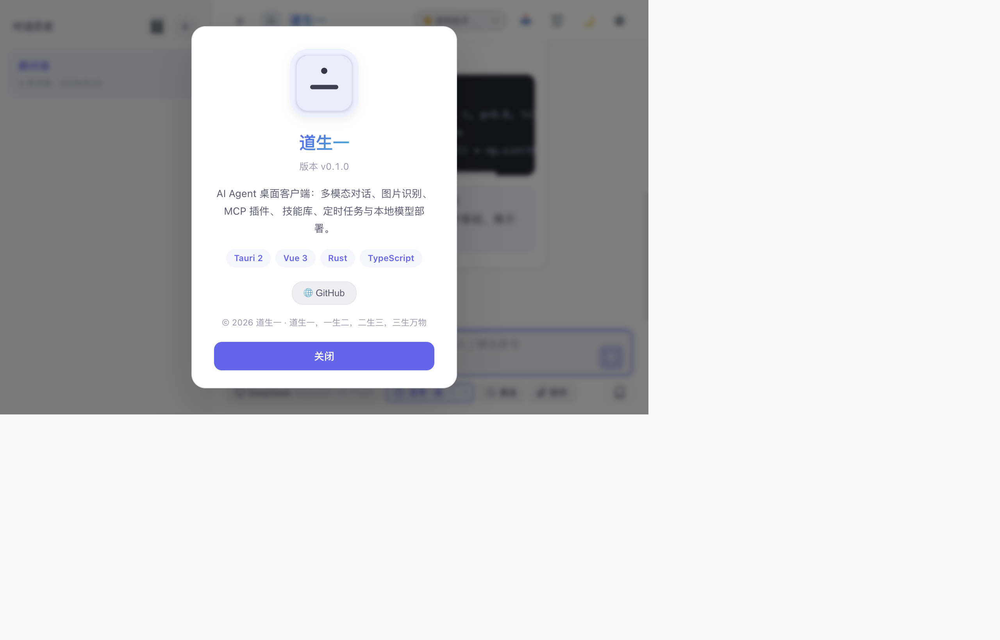

# 道生一 (DaoShengYi) — AI Agent 桌面客户端

> 「道生一，一生二，二生三，三生万物。」—— 从一句话开始，让 AI 帮你完成更多。
>
> 一个**本地优先**的 AI Agent 桌面客户端，基于 **Tauri 2 + Vue 3 + Rust** 构建。深度绑定 **DeepSeek** 等国产大模型，同时支持本地 **Ollama** 视觉模型与 macOS 系统 **OCR**，让对话不只是聊天，更能自主调用工具、操作浏览器、读写文件、执行命令。

## 📸 界面截图

| 浅色主题对话 | 深色主题对话 |
|---|---|
|  |  |

| 设置面板 | 关于道生一 |
|---|---|
|  |  |

## ✨ 功能特性

### 🤖 智能对话
- **流式输出** — Rust SSE 流式渲染，分块不丢字，逐字显示
- **深度思考展示** — 展开/折叠模型的推理过程（reasoning_content）
- **多模型 Profile** — DeepSeek 默认，可配置任意 OpenAI 兼容端点；本地 Ollama 一键接入
- **多模型路由** — 按任务类型（对话 / 编程 / 摘要）自动选用不同 Profile
- **日期防幻觉** — 自动注入当天日期，回答“今天/今年”类问题不胡诌
- **缓存命中率统计** — 解析模型 `usage.prompt_cache_hit/miss_tokens`，顶栏实时显示 `缓存 xx%`
- **数学公式渲染** — KaTeX 渲染 `$...$` / `$$...$$` / `\(...\)` 等 LaTeX 公式，兼容中文紧贴与全角标点
- **Markdown 增强** — 高亮/列表/标题 + 本地文件路径自动转可点击链接（系统应用打开）

### 🛠 Agent 工具调用（流式工具循环）
- **自主决策** — 模型流式中检测 `<tool_call>` 自动调用工具、结果回填、多轮迭代（上限 20 轮），思考过程跨轮累积展示
- **内置工具（20+）**：
  - 网页：`fetch_page` 抓取、`web_search` 多源搜索（百度/必应/360/搜狗 + 自动抓正文）
  - 视觉：`describe_image` / `ocr_image`（本地 Ollama / macOS Vision）
  - 文件：`read_file` / `write_file` / `replace_string` / `insert_string` / `create_file` / `delete_file` / `list_dir`（unified diff 预览 + 撤销）
  - 代码：`analyze_project` / `code_index` / `code_search`（语义找代码）/ `run_tests` / `git`
  - 知识：`kb_index` / `kb_search`（RAG 混合检索）/ `pdf_read`
  - 记忆：`memory_save` / `memory_recall` / `memory_forget`
  - 协作：`subagent_delegate` / `subagent_parallel`（并行 + 角色 + 仲裁）
  - 规划：`plan_task` / `plan_update`（任务进度卡片）
  - 推送：`send_im`（飞书 / 企业微信 / 钉钉）
- **MCP 客户端** — stdio 连接 + 插件市场 + 按需懒激活（浏览器自动化 / 文件系统等）；工具路由容错自动激活
- **过程透明** — 工具调用卡片实时展示（参数折叠、结果摘要）

### 🧑‍💻 编程代理
- **验证循环** — 自动检测测试框架（npm / cargo / pytest）运行测试，失败迭代修复直到通过
- **多文件精确编辑** — replace / insert / delete 三原语 + unified diff 预览 + 应用内确认 + 会话内撤销
- **Git 集成** — status / diff / commit / push 等（白名单子命令 + 拒绝破坏性参数）
- **代码库理解** — 技术栈识别、结构统计、语义索引「自然语言找代码」+ 符号跳行
- **任务规划** — Plan → Act → Observe → 修正 循环（进度卡片）

### 👥 多 Agent 协作
- **子代理委派** — `subagent_delegate` 单任务独立上下文；`subagent_parallel` 并行执行（并发 ≤4）
- **角色分工** — planner / executor / verifier / reviewer / researcher 五种角色，工具集约束双保险
- **汇总仲裁** — 并行完成后评审角色汇总仲裁，主代理统一呈现
- **浏览器锁** — 多子代理操作同一浏览器自动串行化，避免状态竞争

### 🔀 可视化工作流
- **DAG 编辑器** — VueFlow 拖拽画布：文本 / LLM / 工具 / 条件分支 / 代码节点
- **模板库** — 研究助手 / 文案润色 / 日报生成 / Bug 分流 等内置模板
- **持久化** — 工作流保存 / 载入 + 运行历史记录

### 📡 IM 网关与主动推送
- **主动推送** — `send_im` 推送到飞书 / 企业微信 / 钉钉群机器人（支持钉钉加签）
- **IM 网关** — 钉钉 / 飞书长连接双向收发：收到消息 → 调用 agent → 回发结果（设置「即时聊天」）

### 💬 会话管理
- **会话分支（fork）** — 全量复制或从某条消息起分支为新对话（历史「⛓」/ 消息旁「分支」）
- **异步投递（queue）** — 向历史会话投递任务，后台执行完成后自动刷新（历史「✉」）
- **归档 / 导出** — 会话归档隐藏、导出 Markdown
- **撤销操作** — 文件编辑 / 新建 / 删除自动快照，一键回滚（撤销气泡 + 回放面板）

### 🎭 多模式
- **6 种运行模式** — 对话 / 任务 / 办公 / 研究 / 编码 / 速答（模式 = 系统提示词 + 工具白名单），输入框一键切换、记忆常用模式
- **人格 × 模式 × 角色** 三层正交 — 决定「我是谁 / 我怎么做 / 子代理角色」

### 🖥 生产力能力
- **`/run <命令>`** — 直接执行终端命令（shell 语义 + 超时 + 危险命令审批）
- **`/read <路径>`** — 读取本地文件内容供 AI 分析
- **交互式终端（PTY）** — 设置「终端」Tab 启动 / 交互 dev server、REPL 等长驻进程
- **非交互执行（CLI）** — `daoshengyi --exec "<prompt>" [--json]` 供脚本 / CI 调用引擎
- **定时任务** — 设置「定时任务」定时执行命令 / 推送
- **Token / 费用统计** — 本地估算 + 价格表，历史累计（含已删除会话）

### 🧠 长期记忆与知识库
- **记忆系统** — 事实提取 + 去重合并 + FTS5 中文全文检索 + Ollama 语义向量 + 衰减遗忘
- **记忆分层** — 事实（semantic）+ 会话摘要 + 跨会话主题聚合（episodic）
- **用户画像** — 偏好 / 身份稳定注入，主动记忆工具（save / recall / forget）
- **记忆管理** — 可视化面板：事实列表 / 编辑 / 智能复习
- **知识库 RAG** — 本地目录索引（kb_index）+ 混合检索 + 对话自动注入

### 🔒 安全与体验
- **命令执行策略引擎** — 规则文件（`allow/deny/prompt <命令前缀>`）持久化审批决策，设置「权限」可编辑 / 测试
- **权限矩阵** — 禁用工具 + 路径白名单 + 会话级权限记忆 + 文件编辑确认
- **审计面板** — 工具调用全记录（参数 / 结果 / 耗时）+ 筛选 + 导出
- **API Key 加密落盘** — AES-256-GCM，密钥文件权限 0600
- **本地优先** — 数据、密钥、记忆全部存储在本机
- **系统托盘 / 全局快捷键** — 托盘图标 + `Ctrl+Shift+Space` 显隐 / `Ctrl+Shift+K` 新对话（可配置）
- **中文系统菜单栏** — 6 个菜单，快捷键直达核心功能

## 技术栈

| 层级 | 技术 |
|------|------|
| 前端框架 | Vue 3（Composition API + `<script setup>`） |
| 构建工具 | Vite 5 |
| 类型系统 | TypeScript |
| 状态管理 | Pinia |
| 桌面框架 | Tauri 2（Rust） |
| 后端能力 | reqwest、tokio、SQLite（rusqlite）、AES-256-GCM、portable-pty、tokio-tungstenite |
| 工作流 | VueFlow（DAG 可视化工作流） |
| Markdown | marked + highlight.js + KaTeX（数学公式） |
| 本地视觉 / 向量 | Ollama（llava-phi3 / nomic-embed-text） |
| 本地 OCR | macOS Vision（`ocr_tool.swift`） |
| 图标 | lucide-vue-next |

## 🚀 快速开始

### 环境要求

- **Node.js** >= 18
- **Rust** >= 1.70
- **macOS / Windows / Linux**

### 安装依赖

```bash
npm install
```

### 开发模式

```bash
npm run tauri dev
```

### 生产构建

```bash
npm run tauri build
```

> 💡 macOS 上首次构建会自动编译 OCR 工具（`swiftc -O ocr_tool.swift`，增量编译）。

## 📖 使用指南

### 1. 配置 API

「设置 → API 配置」中填写：
- **API 地址** — 如 `https://api.deepseek.com`
- **API Key** — 你的密钥（AES-256-GCM 加密保存）
- **模型** — 如 `deepseek-v4-flash`、`deepseek-reasoner`

### 2. 一键部署本地 Ollama（可选）

「设置 → Ollama」点击一键部署即可（无需 Homebrew）：
1. 官方 zip 直装到 `~/Applications/Ollama.app`，断点续传、失败可重试
2. 自动拉取视觉模型（如 `llava-phi3:3.8b`）并显示进度
3. 自动添加 `ollama` API Profile，用于图片识别

### 3. 启用 MCP 服务器 / 技能 / 记忆

- **MCP** —「设置 → MCP」从内置市场添加（浏览器自动化/记忆/文件系统），勾选启用后对话中按需自动连接
- **技能** —「设置 → 技能」启用技能或导入导出
- **记忆** — 对话中自动提取关键事实并检索注入

### 4. 图片识别

直接发送图片即可：主模型非视觉时自动用本地 Ollama + OCR 识别成文字描述后交给模型；支持图片的模型则直接多模态输入。

### 5. 终端命令与文件

- 输入框输入 `/run ls -la` 执行命令
- 输入框输入 `/read src/App.vue` 读取文件

### 6. 命令执行策略（S1）

「设置 → 权限 → 命令执行策略」维护规则文件（`allow|deny|prompt <命令前缀>`）：
- `deny rm -rf` 直接拦截；`allow git status` 不再确认；`prompt` 必须确认
- 未命中规则时走默认三档审批（manual / smart / yolo）
- 可「测试」任意命令的决策结果

### 7. 项目指令（S2）

在项目根（或任意层级）放 `AGENTS.md` 或 `道生一.md`，对话时会自动发现并注入该项目的编码规范 / 测试命令 / 目录说明（就近优先，优先于通用约定）。

### 8. 会话分支与投递（S4）

- **分支**：对话历史点 ⛓ 复制整个会话；用户消息旁点「分支」从此消息起新对话
- **投递**：对话历史点 ✉ 向该会话投递任务，后台执行完成后自动刷新

### 9. 交互式终端（PTY，S7）

「设置 → 终端」启动长驻 / 交互进程（`npm run dev`、`python3`、`node -i` 等），实时查看输出并输入指令。

### 10. 非交互执行（CLI，S6）

```bash
daoshengyi --exec "用一句话介绍自己"      # 纯文本输出
daoshengyi --exec "整理待办" --json       # JSONL 事件流（脚本 / CI 用）
daoshengyi --mcp-server                   # 以 MCP 服务器暴露能力（供 Claude Desktop 等）
```

## 📁 项目结构

```
daoshengyi/
├── src/                        # Vue 3 前端
│   ├── api/                    # API 请求层（agent / appSettings / search）
│   ├── assets/styles/          # 全局样式
│   ├── components/             # 组件
│   │   ├── AppLogo.vue         # 品牌 Logo
│   │   ├── ChatHistory.vue     # 对话历史侧边栏（分支 / 投递 / 归档）
│   │   ├── ChatInput.vue       # 消息输入框（模式切换）
│   │   ├── ChatMessage.vue     # 消息气泡（流式 + Markdown + KaTeX + 思考 + 分支）
│   │   ├── McpSettings.vue     # MCP 服务器设置
│   │   ├── SettingsDialog.vue  # 设置（API/插件/Ollama/用量/诊断/定时/推送/记忆/知识库/即时聊天/审计/撤销/权限/快捷键/终端）
│   │   ├── SkillManager.vue    # 技能管理
│   │   ├── MemoryPanel.vue     # 记忆管理面板
│   │   ├── AuditPanel.vue      # 审计面板
│   │   ├── UndoPanel.vue       # 撤销回放面板
│   │   ├── ImGatewayPanel.vue  # IM 网关面板
│   │   ├── HealthPanel.vue     # 运行时诊断
│   │   ├── UsageStats.vue      # 用量统计
│   │   ├── ScheduledTasks.vue  # 定时任务
│   │   ├── PtyPanel.vue        # 交互式终端（PTY）
│   │   ├── TaskPlanCard.vue    # 任务进度卡片
│   │   ├── WorkflowDialog.vue  # 可视化工作流
│   │   ├── SubagentPanel.vue   # 子代理进度面板
│   │   ├── DiffConfirmDialog.vue # 文件编辑 diff 确认
│   │   └── ...                 # 其他（AboutDialog / QuickBar / 等）
│   ├── data/                   # 静态数据（内置工具 / MCP 市场 / 提示词 / 技能 / 模式 / 角色 / 工作流模板）
│   ├── stores/                 # Pinia 状态（chat / mcp / memory / ollama / skill / ui / pty）
│   ├── utils/                  # 工具（tool-call / permissions / model-routing / workflow-engine / agents-md / 记忆 / 搜索门等）
│   ├── types/index.ts          # TypeScript 类型定义
│   ├── App.vue                 # 主布局
│   └── main.ts                 # 入口（含事件监听）
├── src-tauri/                  # Tauri 2 后端
│   ├── src/
│   │   ├── main.rs             # Rust 入口（--mcp-server / --exec 分发）
│   │   ├── lib.rs              # Tauri 命令注册与核心命令（60+）
│   │   ├── api.rs              # SSE 流式 / 非流式请求 / 缓存命中解析
│   │   ├── db.rs               # SQLite 持久化（会话/记忆/知识库/工作流/审计/撤销）
│   │   ├── execpolicy.rs       # 命令执行策略引擎（S1）
│   │   ├── pty.rs              # 交互式终端 PTY（S7）
│   │   ├── im.rs               # IM 网关（钉钉 / 飞书 / 企业微信）
│   │   ├── mcp.rs              # MCP stdio 连接与工具调用
│   │   ├── mcp_server.rs       # MCP 服务器模式（暴露记忆 / 搜索能力）
│   │   ├── middleware.rs       # 系统消息注入
│   │   ├── search.rs           # 多源网络搜索
│   │   └── settings.rs         # 配置 + AES-256-GCM 加密
│   ├── ocr_tool.swift          # macOS Vision OCR 源码
│   ├── build.rs                # 自动编译 OCR 工具（增量）
│   ├── Cargo.toml
│   ├── tauri.conf.json         # Tauri 配置（含 OCR 资源打包）
│   └── capabilities/           # 权限配置
├── docs/
│   ├── ROADMAP.md              # 开发路线图
│   ├── DEVELOPMENT_PLAN.md     # 开发计划（含 §3.12 Codex 能力整合）
│   ├── DEVELOPMENT_PROGRESS.md # 开发进度
│   ├── IM_GATEWAY.md           # IM 网关设计
│   └── CODEX_CAPABILITY_ANALYSIS.md # Codex 开源能力研究与技能整合分析
├── scripts/                    # 测试脚本（tokens / 模板 / 工具 / 项目指令 / 数学公式）
├── index.html
├── package.json
├── vite.config.ts
└── tsconfig.json
```

## 🧪 测试

```bash
npm test
```

## 🔍 日志与排障

运行时日志写入 `~/Library/Application Support/com.daoshengyi.app/daoshengyi.log`（包含模型请求、MCP 连接/断开、SSE 流式等诊断信息），可在终端用 `tail -f` 查看。

## 📄 License

MIT
